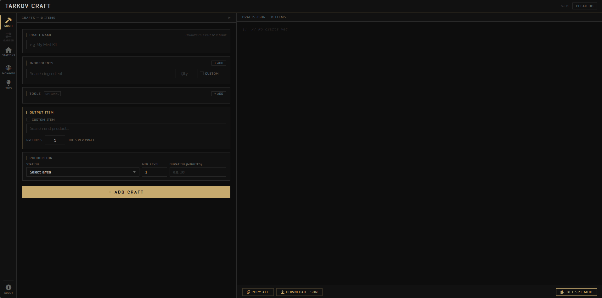

# Tarkov Craft

A web tool for creating custom Escape from Tarkov hideout craft recipes.

## Features

- Game-ready JSON output
- Real-time item search via Tarkov API
- Local search caching
- Responsive interface
- Recipe export
- One-click MongoID copy for SPT modding

## Usage

Visit the [Live Demo](https://viniHNS.github.io/TarkovCraft), fill in the craft recipe fields, add items using the integrated search, then click `ADD craft` and choose `Download JSON` to download your recipe or `Copy ALL` to copy it to your clipboard.

## License

MIT. See [LICENSE](LICENSE) for details.

---

*Not affiliated with Battlestate Games. Data sourced from public API.*
